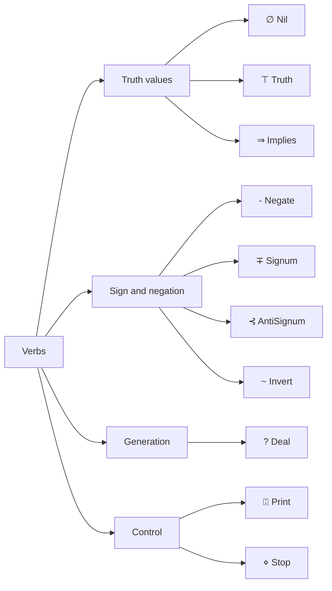

# Verb Index

```mermaid
graph LR
    V["Verbs"] --> T["Truth values"]
    V --> S["Sign and negation"]
    V --> G["Generation"]
    V --> C["Control"]
    T --> Nil["∅ Nil"]
    T --> Truth["⊤ Truth"]
    T --> Implies["⇒ Implies"]
    S --> Negate["- Negate"]
    S --> Signum["∓ Signum"]
    S --> AntiSignum["⊰ AntiSignum"]
    S --> Invert["~ Invert"]
    G --> Deal["? Deal"]
    C --> Print["⍠ Print"]
    C --> Stop["⋄ Stop"]
    click Nil "manual-page-0-nil.md"
    click Truth "manual-page-back-truth.md"
    click Implies "manual-page-4-implies.md"
    click Negate "manual-page-1-negate.md"
    click Signum "manual-page-5-signum.md"
    click AntiSignum "manual-page-6-antisignum.md"
    click Invert "manual-page-3-invert.md"
    click Deal "manual-page-2-deal.md"
    click Print "manual-page-7-print.md"
    click Stop "manual-page-8-diamond.md"
```
