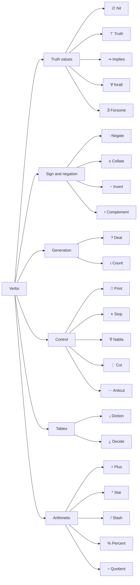

# Verb Index

```mermaid
graph LR
    V["Verbs"] --> T["Truth values"]
    V --> S["Sign and negation"]
    V --> G["Generation"]
    V --> C["Control"]
    V --> TB["Tables"]
    V --> AR["Arithmetic"]
    T --> Nil["∅ Nil"]
    T --> Truth["⊤ Truth"]
    T --> Implies["⇒ Implies"]
    T --> forall["∀ forall"]
    T --> Forsome["∃ Forsome"]
    S --> Negate["- Negate"]
    S --> Collate["± Collate"]
    S --> Invert["~ Invert"]
    S --> Complement["≀ Complement"]
    G --> Deal["? Deal"]
    G --> Count["⍳ Count"]
    C --> Print["⍠ Print"]
    C --> Stop["⋄ Stop"]
    C --> Nabla["∇ Nabla"]
    C --> Cut["⋮ Cut"]
    C --> Anticut["⋯ Anticut"]
    TB --> Diction["¡ Diction"]
    TB --> Decide["¿ Decide"]
    AR --> Plus["+ Plus"]
    AR --> Star["* Star"]
    AR --> Slash["/ Slash"]
    AR --> Percent["% Percent"]
    AR --> Quotient["÷ Quotient"]
    click Nil "https://github.com/IronAutie/Wuxia-The-Manual/blob/main/manual-page-0-nil.md"
    click Truth "https://github.com/IronAutie/Wuxia-The-Manual/blob/main/manual-page-back-truth.md"
    click Implies "https://github.com/IronAutie/Wuxia-The-Manual/blob/main/manual-page-4-implies.md"
    click forall "https://github.com/IronAutie/Wuxia-The-Manual/blob/main/manual-page-15-forall.md"
    click Forsome "https://github.com/IronAutie/Wuxia-The-Manual/blob/main/manual-page-16-forsome.md"
    click Negate "https://github.com/IronAutie/Wuxia-The-Manual/blob/main/manual-page-1-negate.md"
    click Collate "https://github.com/IronAutie/Wuxia-The-Manual/blob/main/manual-page-5-collate.md"
    click Invert "https://github.com/IronAutie/Wuxia-The-Manual/blob/main/manual-page-3-invert.md"
    click Complement "https://github.com/IronAutie/Wuxia-The-Manual/blob/main/manual-page-12-complement.md"
    click Deal "https://github.com/IronAutie/Wuxia-The-Manual/blob/main/manual-page-2-deal.md"
    click Count "https://github.com/IronAutie/Wuxia-The-Manual/blob/main/manual-page-8-count.md"
    click Print "https://github.com/IronAutie/Wuxia-The-Manual/blob/main/manual-page-6-print.md"
    click Stop "https://github.com/IronAutie/Wuxia-The-Manual/blob/main/manual-page-7-diamond.md"
    click Nabla "https://github.com/IronAutie/Wuxia-The-Manual/blob/main/manual-page-9-nabla.md"
    click Cut "https://github.com/IronAutie/Wuxia-The-Manual/blob/main/manual-page-10-cut.md"
    click Anticut "https://github.com/IronAutie/Wuxia-The-Manual/blob/main/manual-page-11-anticut.md"
    click Diction "https://github.com/IronAutie/Wuxia-The-Manual/blob/main/manual-page-13-diction.md"
    click Decide "https://github.com/IronAutie/Wuxia-The-Manual/blob/main/manual-page-14-decide.md"
    click Plus "https://github.com/IronAutie/Wuxia-The-Manual/blob/main/manual-page-17-plus.md"
    click Star "https://github.com/IronAutie/Wuxia-The-Manual/blob/main/manual-page-18-star.md"
    click Slash "https://github.com/IronAutie/Wuxia-The-Manual/blob/main/manual-page-19-slash.md"
    click Percent "https://github.com/IronAutie/Wuxia-The-Manual/blob/main/manual-page-20-percent.md"
    click Quotient "https://github.com/IronAutie/Wuxia-The-Manual/blob/main/manual-page-21-quotient.md"
```
